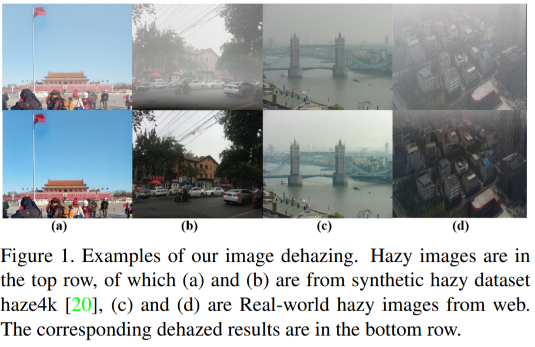
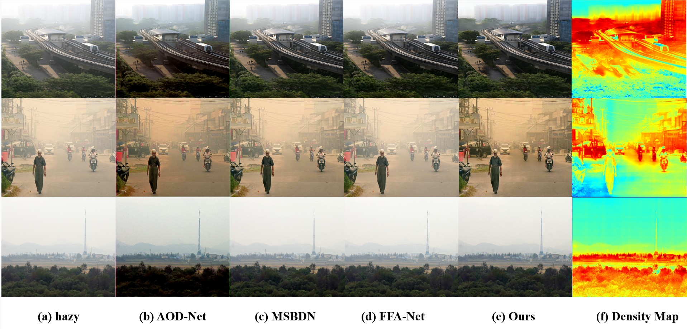
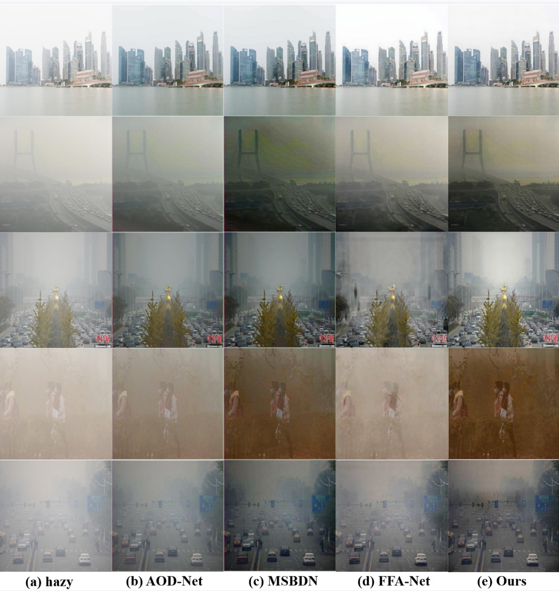

# Perceiving-and-Modeling-Density-for-Image-Dehazing ECCV'22 Oral

The official repository of "Perceiving and Modeling Density is All You Need for Image Dehazing". [arxiv link](https://arxiv.org/abs/2111.09733)

## Noting!
We have already updated the latest manuscript. Please visit Google Drive to get it.

The code will be released soon.

## Abstract
**In the real world, the degradation of images taken under haze can be quite complex, where the spatial distribution of haze is varied from image to image. Recent methods adopt deep neural networks to recover clean scenes from hazy images directly. However, due to the paradox caused by the variation of real captured haze and the fixed degradation parameters of the current networks, the generalization ability of recent dehazing methods on real-world hazy images is not ideal. To address the problem of modeling real-world haze degradation, we propose to solve this problem by perceiving and modeling density for uneven haze distribution. We propose a novel Separable Hybrid Attention (SHA) module to encode haze density by capturing features in the orthogonal directions to achieve this goal. Moreover, a density map is proposed to model the uneven distribution of the haze explicitly. The density map generates positional encoding in a semi-supervised way—such a haze density perceiving and modeling capture the unevenly distributed degeneration at the feature level effectively. Through a suitable combination of SHA and density map, we design a novel dehazing network architecture, which achieves a good complexity-performance trade-off.**

**The extensive experiments on two large-scale datasets demonstrate that our method surpasses all state-of-the-art approaches by a large margin both quantitatively and qualitatively, boosting the best published PSNR metric from 28.53 dB to 33.49 dB on the Haze4k test dataset and from 37.17 dB to 38.41 dB on the SOTS indoor test dataset.**

## Results on Real-world hazy images

